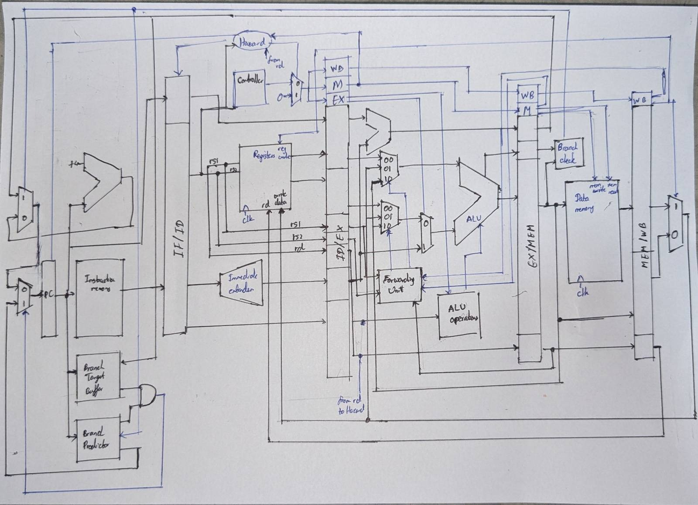

# RV32I Five-Stage Pipelined Processor

A 32-bit five-stage pipelined RISC-V processor implemented in SystemVerilog, 
supporting the RV32I base integer instruction set.

## Features

- **Five-stage pipeline**: Fetch, Decode, Execute, Memory, Writeback
- **Data forwarding unit**: Resolves RAW hazards without unnecessary stalls
- **Two-bit saturating branch predictor**: Reduces control hazard penalties
- **Set-associative cache**: Separate instruction and data caches for improved 
  memory access efficiency

## Repository Structure
- rtl/          # SystemVerilog RTL source files
- pipeline_drawn-final.jpeg  # Pipeline architecture diagram
- Group-x86-200082E-200164H-200207U.pdf  # Project report

## Pipeline Architecture

## Getting Started

### Prerequisites
- ModelSim or any SystemVerilog-compatible simulator
- Xilinx Vivado (for synthesis)

### Simulation
Import RTL sources from the `rtl/` directory into your simulator and run 
the provided testbenches.

## Contributors

- Rathnayakage Mewan Chandira (200082E)
- [200164H]
- [200207U]

## License

This project was developed as a course assignment at the Department of 
Electronic and Telecommunication Engineering, University of Moratuwa.
